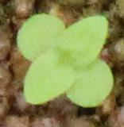

# ディープラーニングによる雑草の画像分類モデル

## By whom?

勘崎秀門 石井昌範

東京大学フィールドフェノミクス研究拠点

## What is it?

- 雑草分類に関する深層学習のチュートリアル。
- Google Colaboratoryベースのノートブックです。 必要なのは、インターネット接続、Google Chromeブラウザ、およびGoogleアカウントだけです。 **クリックでGPU学習環境！**
- ノートブックを開くには、各セクションの をクリックします。 コードのカスタマイズと保存には、GoogleアカウントにログインしてローカルのGoogleドキュメントフォルダーにipynbをコピーすることをお勧めします。
## Note

- このノートブックの目的は、非情報学者向けに植物科学と農業でディープラーニングを実行する方法の概要を取得することです。
- バックグラウンドでTensorflowが動作するKerasは、ノートブックで使用されるメインのディープラーニングフレームワークです。

## Notebooks Open

### 01　雑草の生育期間を区別せずに分類器を作る(2020/5/25)

   

    

雑草の生育期間（芽生え・生育済み）を区別せずに分類器を作成します。
育成した雑草の種類はハキダメギク、ホソアオゲイトウ、イチビ、イヌビエ、コセンダングサ、マメアサガオ、メヒシバ、オヒシバ、オイヌタデ、シロザの10種類です。

 Google Colaboratoryは必ずランタイムを初期化してから実行してください。

 

### 02　雑草の生育期間を区別して分類器を作る（芽生え）(2020/5/25)

   

    

雑草の生育期間が芽生えのデータを用いて分類器を作成します。
育成した雑草の種類はハキダメギク、ホソアオゲイトウ、イチビ、イヌビエ、コセンダングサ、マメアサガオ、メヒシバ、オヒシバ、オイヌタデ、シロザの10種類です。

 Google Colaboratoryは必ずランタイムを初期化してから実行してください。

 

### 03　雑草の生育期間を区別して分類器を作る（生育済み）(2020/5/25)

   

    

雑草の生育期間が生育済みのデータを用いて分類器を作成します。
育成した雑草の種類はハキダメギク、ホソアオゲイトウ、イチビ、イヌビエ、コセンダングサ、マメアサガオ、メヒシバ、オヒシバ、オイヌタデ、シロザの10種類です。

 Google Colaboratoryは必ずランタイムを初期化してから実行してください。

 

### 04　科目が同じ品種をグループにして分類器を作る（生育済み）(作成中)

   

    

雑草の生育期間が生育済みのデータを用いて分類器を作成します。
ハキダメギク、ホソアオゲイトウ、イチビ、イヌビエ、コセンダングサ、マメアサガオ、メヒシバ、オヒシバ、オイヌタデ、シロザの10種類の雑草のうち科目が同じのものを一つのclassにまとめるます。イネ科（イヌビエ、メヒシバ、オヒシバ）、キク科（ハキダメギク、コセンダングサ）とその他5種類に分けて分類器を作成します。

 Google Colaboratoryは必ずランタイムを初期化してから実行してください。

 

### 05　イネ科、ツル植物（マメアサガオ）、広葉雑草の3種類にクラスの分けして分類器を作る（生育済み）(作成中)

   

    

雑草の生育期間が生育済みのデータを用いて分類器を作成します。
ハキダメギク、ホソアオゲイトウ、イチビ、イヌビエ、コセンダングサ、マメアサガオ、メヒシバ、オヒシバ、オイヌタデ、シロザの10種類の雑草をイネ科、ツル植物（マメアサガオ）、広葉雑草の3種類に分けて分類器を作成します。

 Google Colaboratoryは必ずランタイムを初期化してから実行してください。

 

<!--
### VGG16をファインチューニングして雑草分類（アンサンブル学習）(2020 5/9)

   

    

雑草の生育期間が生育済みのデータを用いて分類器を作成します。
ハキダメギク、ホソアオゲイトウ、イチビ、イヌビエ、コセンダングサ、マメアサガオ、メヒシバ、オヒシバ、オイヌタデ、シロザの10種類の雑草をイネ科、ツル植物（マメアサガオ）、広葉雑草の3種類に分けて分類器を作成します。
さらに今回は3つのtrainデータを作成しアンサンブル学習を行いました。

 Google Colaboratoryは必ずランタイムを初期化してから実行してください。

 
-->

